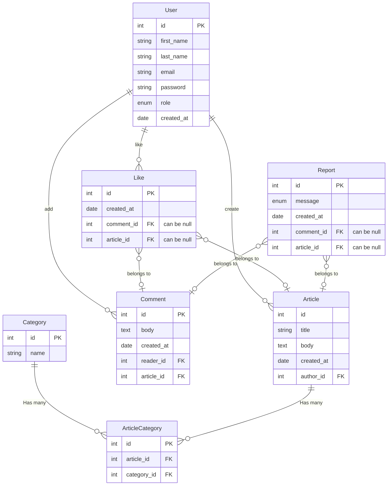

```mermaid
erDiagram
    User {
        int id PK
        string first_name
        string last_name
        string email
        string password
        enum role
        date created_at
    }


    Article{
        int id
        string title
        text body
        date created_at
        int author_id FK
    }


    Comment {
        int id PK
        text body
        date created_at
        int reader_id FK
        int article_id FK
    }

    Like {
        int id PK
        date created_at
        int comment_id FK "can be null"
        int article_id FK "can be null"
    }

    Category {
        int id PK
        string name
    }

    Report {
        int id PK
        enum message
        date created_at
        int comment_id FK "can be null"
        int article_id FK "can be null"
    }

    ArticleCategory{
        int id PK
        int article_id FK
        int category_id FK
    }

    User ||--o{ Article : create

    User ||--o{ Comment : add

    User ||--o{ Like : like

    Category ||--o{ ArticleCategory : "Has many"

    Article ||--o{ ArticleCategory : "Has many"

    Like }o--|o Comment : "belongs to"

    Like }o--|o Article : "belongs to"

    Report }o--|o Comment : "belongs to"

    Report }o--|o Article : "belongs to"
```